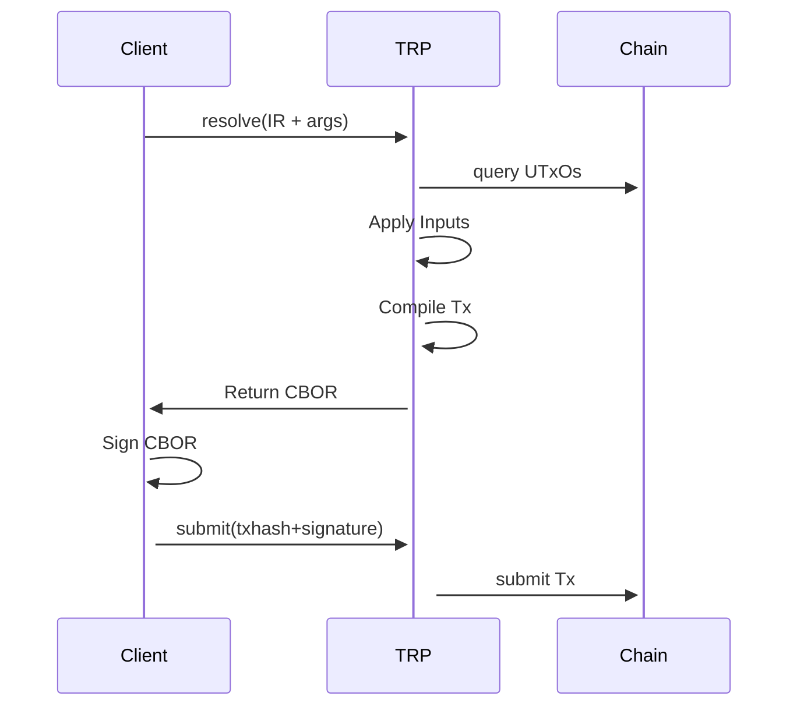

Sequence diagram of how the Client interacts with the chain through a TRP endpoint.

```mermaid
sequenceDiagram
    Client->>+TRP: resolve(IR + args)
    TRP->>+Chain: query UTxOs
    TRP->>+TRP: Apply Inputs
    TRP->>+TRP: Compile Tx
    TRP->>+Client: Return CBOR
    Client->>+Client: Sign CBOR
    Client->>+TRP: submit(txhash+signature)
    TRP->>+Chain: submit Tx
```    